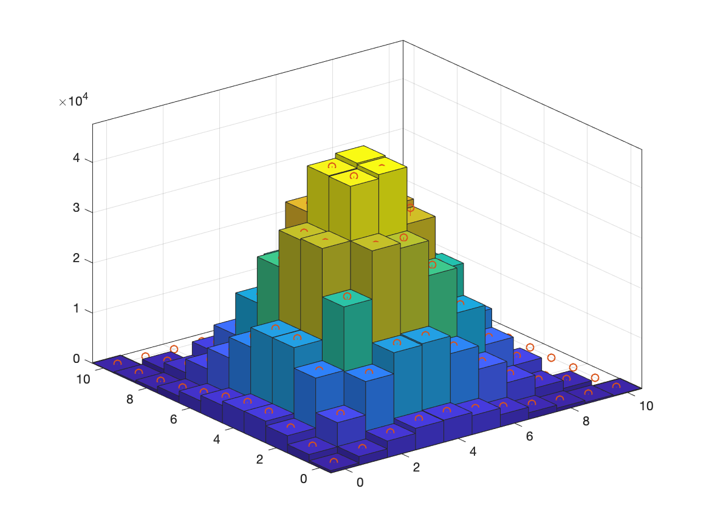

# Stochastic Simulation in MATLAB/Python

## TOC

- [ ] Random Number Generation
- [x] Statistical Test
- [ ] Discrete Random Variable Generation
- [x] Continuous Random Variable Generation
- [x] Discrete Event Simulation
- [x] Variance Reduction
- [x] Markov Chain Monte Carlo Simulation
- [x] Annealing Mat-heuristics Optimization
- [x] Bootstrap

## 2-D Irregular Sample Space for 8-Direction Random Walk

The result from MCMC simulation using Gibbs Sampler and sample space processed by this algorithm is quite satisfying. The red points indicate the theoretical values, which are almost all the same as the simulation results.

